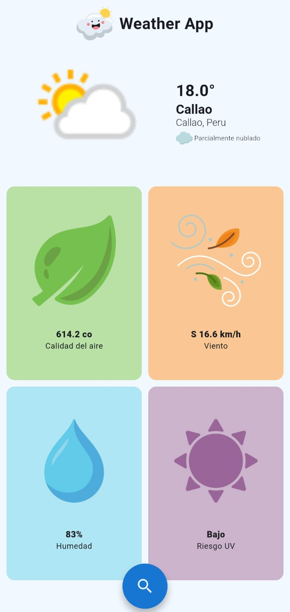
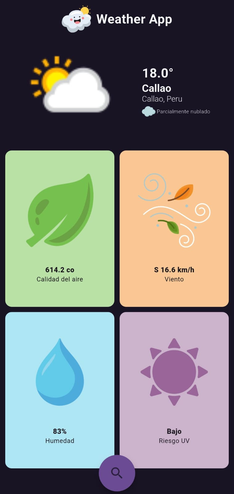

 

# WeatherApp 🌦️

**WeatherApp** es una aplicación móvil desarrollada en **Flutter** que permite visualizar el clima actual y el pronóstico según una ciudad.

---

## 🧭 Funcionalidades principales

- Consulta del clima actual: temperatura, estado del cielo, humedad, velocidad del viento, etc.
- Pronóstico meteorológico.
- Geolocalización automática del usuario (si se otorgan permisos).
- Búsqueda por nombre de ciudad.

---

## 📦 Requisitos previos

- Flutter SDK instalado (versión estable recomendada).
- API key de servicio meteorológico WeatherAPI.

---

## 🚀 Instalación

1. Clona este repositorio:
    
    ```bash
    
    git clone https://github.com/joalmr/weatherapp.git
    cd weatherapp
    
    ```
    
2. Instala las dependencias:
    
    ```bash
    
    flutter pub get
    
    ```
    
3. Crea un archivo `.env` en la raíz del proyecto y añade tu clave de API:
    
    ```ini
    
    WEATHER_KEY=tu_api_key_aquí
    
    ```
    
4. Ejecuta la aplicación:
    
    ```bash

    flutter run
    
    ```
    

---

## 🌍 Uso de la aplicación

1. Al iniciar, se solicitarán los permisos de ubicación (si lo habilitas).
2. La app muestra el clima actual de tu ubicación.
3. Puedes buscar cualquier ciudad desde la barra de búsqueda.
4. Visualiza detalles como temperatura, humedad, viento y otros.

---

| Tema Claro | Tema Oscuro |
|------------|-------------|
|  |  |

---

## 🛠 Setup
- Para la gestión de estados se aplica **Provider**
- El llamado a los servicio se realiza con **Dio**
- La navegación es manejada por **GoRouter**

Esta es la estructura de carpetas:

```css
lib/
├── core/
│   ├── constants/
│   ├── routes/
│   ├── theme/
│   └── utils/
├── features/
│   └── weather/
│       ├── data/
│       ├── domain/
│       └── presentation/
│── main.dart
│── .env
└── .env.dev
```
